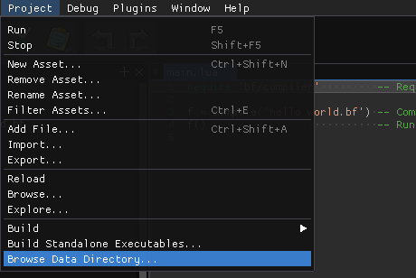
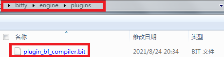
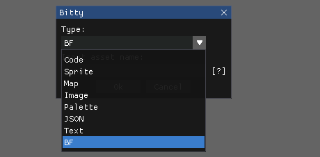
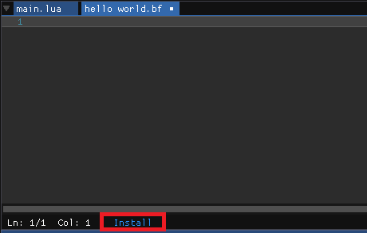
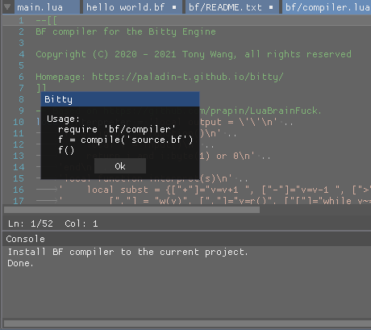
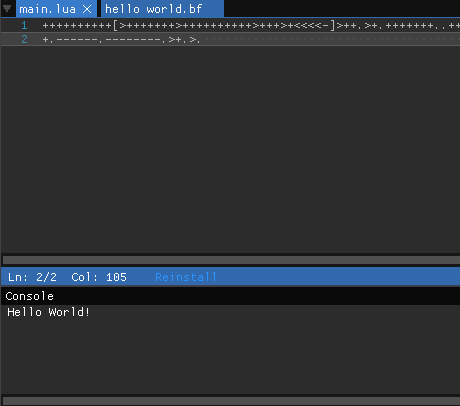
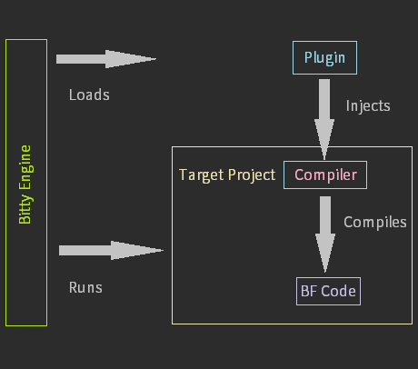

# Compiler plugin for Bitty Engine

This repository demonstrates how to implement a custom compiler/transpiler plugin for [Bitty Engine](https://github.com/paladin-t/bitty) with a BF example.

## Installing

1. Clone or download this repository.

2. Click "Project", "Browse Data Directory..." from the menu bar.



3. Ensure there is a "plugins" directory under that directory.

4. Put the "plugin.bit" into the new created "plugins" directory. And name it properly.



5. Reopen Bitty Engine.

## Injecting

1. Create a new asset, select the registered asset type.



2. Click "Install" to inject necessary assets to the target project.





3. Write and run BF code.



## Principles



Bitty Engine loads plugin to extend its features once it's installed. It loads a BF compiler in this example which can inject the compiler to a target project. And the injected compiler/transpiler runs as regular Bitty code that translates BF code to runnable Lua chunk.

```lua
require 'bf/compiler'               -- Require the compiler.

local f = compile('hello world.bf') -- Compile something.
f()                                 -- Run the compiled chunk.
```

## Write your own compiler plugin

A compiler plugin contains three parts.

### 1. Meta info

Similar to regular Bitty projects, it has an "info.json", define it as you want.

### 2. Main entry

Bitty Engine doesn't run a plugin project directly, it must be installed before running. The execution entry is also named as "main.lua".

But the entry functions are different from regular project. Eg.

```lua
-- Which assets are supposed to be injected from this plugin to target project.
local assets = {
  'bf/compiler.lua',
  'bf/README.txt'
}

-- Tips and example code.
local tips = 'Usage:\n  require \'bf/compiler\'\n  f = compile(\'source.bf\')\n  f()'
local code = 'require \'bf/compiler\'\nf = compile(\'source.bf\')\nf()\n'

-- Plugin entry, called to determine the usage of this plugin.
function usage()
  return { 'compiler' } -- This plugin is a compiler.
end

-- Plugin entry, called to determine the schema of this plugin.
function schema()
  return {
    -- Common.
    name = 'BF',      -- Asset name registered for this plugin.
    extension = 'bf', -- Asset extension registered for this plugin.

    -- List of string.
    keywords = { },
    identifiers = { },
    quotes = { '\'', '"' },
    -- String.
    multiline_comment_start = nil,
    multiline_comment_end = nil,
    -- C++ regex.
    comment_patterns = { '\\#.*' },
    number_patterns = { },
    identifier_patterns = { },
    punctuation_patterns = { '[\\<\\>\\+\\-\\.\\,\\[\\]]' },
    -- Boolean.
    case_sensitive = true,
    -- List of string.
    assets = assets
  }
end

-- Plugin entry, called to install necessary assets to your target project.
function compiler()
  print('Install BF compiler to the current project.')

  waitbox('Installing')
    :thus(function (rsp)
      local install = function (name)
        local data = Project.main:read(name)
        data:poke(1)
        Project.editing:write(name, data) -- Write into the target project.
      end

      for _, asset in ipairs(assets) do -- Install all necessary assets.
        install(asset)
      end

      print('Done.')

      msgbox(tips)
        :thus(function ()
          Platform.setClipboardText(code) -- Put example code to clipboard.
        end)
    end)
end
```

### 3. Assets to be injected

The plugin project also contains assets to be injected. See the plugin in this repository for details.
